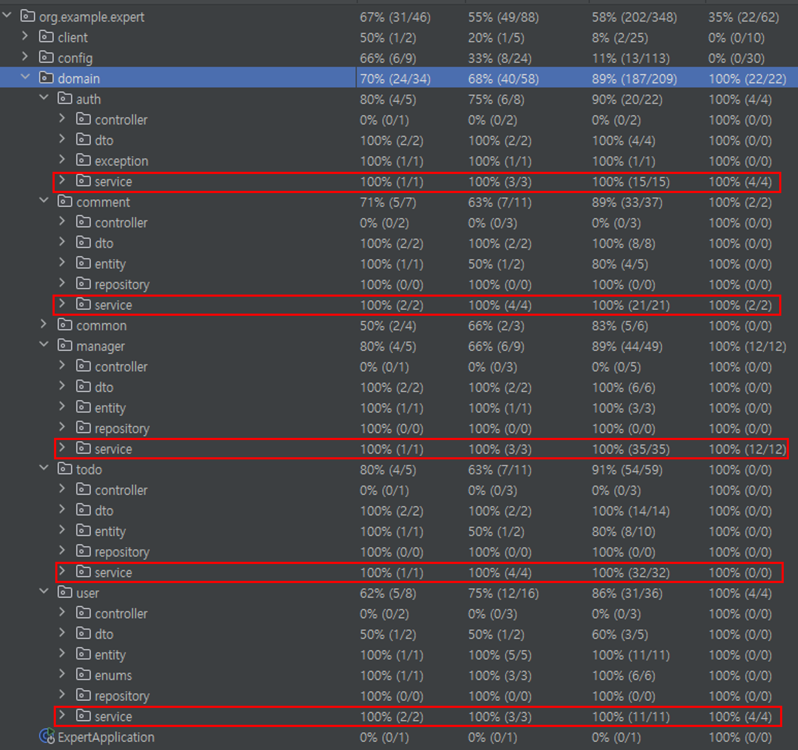

# SPRING ADVANCED PRACTICE


## 🔧 부정확한 요청 파라미터 처리

---

### 1. 문제 인식 및 정의
요청 DTO에 대해 `@Valid` 또는 `@Validated` 검증을 수행할 때, 클라이언트가 **부정확하거나 잘못된 요청 파라미터**를 전달하면 `MethodArgumentNotValidException` 예외가 발생한다.  
기존에는 이 예외를 별도로 처리하지 않아, 에러 응답이 일관되지 않고 클라이언트가 이해하기 어려운 메시지를 받는 문제가 있었다.


### 2. 해결 방안

#### 2-1. 의사결정 과정
- Spring에서 발생하는 `MethodArgumentNotValidException`을 전역적으로 처리하기 위해 `@ExceptionHandler`를 사용하기로 결정
- 에러 응답은 `HttpStatus.BAD_REQUEST(400)`와 함께 클라이언트가 이해할 수 있는 **명확한 오류 메시지**를 전달하는 방식으로 통일
- 응답 형식은 `Map<String, Object>`를 사용하여 재사용 가능하고 확장 가능한 형태로 구성

#### 2-2. 해결 과정
- 예외 핸들러 추가:

```java
@ExceptionHandler(MethodArgumentNotValidException.class)
public ResponseEntity<Map<String, Object>> methodArgumentNotValidException(MethodArgumentNotValidException ex) {
    HttpStatus status = HttpStatus.BAD_REQUEST;
    String defaultErrorMessage = ex.getBindingResult().getFieldError().getDefaultMessage();
    return getErrorResponse(status, defaultErrorMessage);
}
```
- ex.getBindingResult().getFieldError().getDefaultMessage() → DTO 필드의 검증 실패 시 지정된 메시지를 추출
- 추출된 메시지를 getErrorResponse 유틸 메서드에 전달하여 일관성 있는 응답 본문 생성
- 최종적으로 ResponseEntity로 감싸 클라이언트에 반환

### 3. [해결 완료]
#### 3-1. [회고]
- 예외 상황에서도 클라이언트가 이해할 수 있는 명확한 에러 메시지를 전달할 수 있게 되었음.
- 기존처럼 서버 내부 예외 메시지가 노출되지 않아 보안성과 사용자 경험이 개선됨.
  - 현재 코드에선 InternalServerException 핸들링 덕분에 보안 위험성은 없었지만 혹시 모를 사태를 대비  
- 단, 현재는 첫 번째 필드 에러 메시지만 추출하고 있어, 여러 필드가 동시에 잘못된 경우 모든 메시지를 반환하도록 개선할 필요가 있음.

#### 3-2. [전후 데이터 비교]

- 적용 전: 불정확한 InternalServerException 또는 불필요하게 상세한 서버 내부 메시지 노출.

- 적용 후:
```json
{
"status": 400,
"error": "잘못된 요청입니다.",
"message": "이메일은 필수 입력 항목입니다."
}
```
- 클라이언트가 바로 이해하고 수정할 수 있는 형태의 응답 제공.


---
# 🧪 테스트 커버리지
- 서비스 로직에 대한 테스트 커버리지 100%를 목표로 하였습니다.

